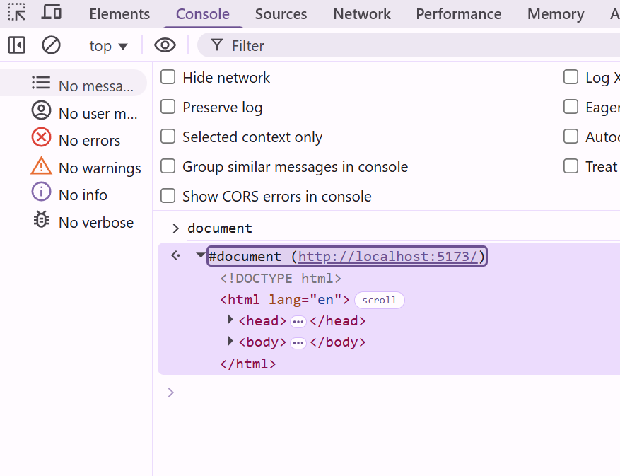
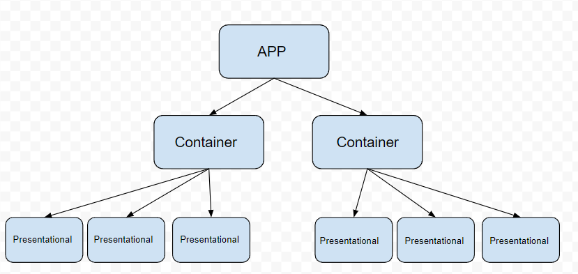
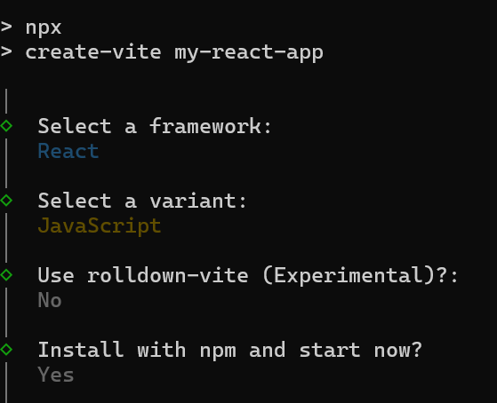

# Introduction to React

## Learning Goals

Utilize Vite to build a basic React application.

- [ ] **Use React build tools to scaffold a React application.**
- [ ] **Implement React Components to render JSX**
- [ ] **Pass data though component props**
- [ ] **Understand component hierarchy.**

## The DOM

The DOM, or Document Object Model, is a collection of JavaScript objects that interface with HTML to control a webpage’s functionality.

You can explore it using the document keyword in your browser’s console or in `console.log(document)`. When you inspect the document object, you’ll notice it closely resembles your HTML structure.

Think of the DOM as a layer on top of your HTML that gives you access to powerful JavaScript functionality for updating and changing what appears in the browser.

[More on the DOM here](https://developer.mozilla.org/en-US/docs/Web/API/Document_Object_Model)

## Dom manipulation

With vanilla JavaScript, DOM manipulation can take a bit of work.

**Note:** We’re about to cover quite a bit here. Take your time to absorb it, but don’t worry about memorizing everything. Soon, we’ll start using a framework that handles much of this automatically, but it’s important to understand what’s happening _under the hood._

---

### Steps

1. **Import your JavaScript file**

   Use a `<script>` tag in your HTML:

   ```html
   <script defer src="script.js"></script>
   ```

   The `defer` attribute ensures the script runs _after_ the HTML document has loaded.  
   This is important because we can’t manipulate HTML elements before they exist in the DOM.  
   The `src` attribute points to the JavaScript file you want to load.

2. **Select an element**

   Use `document` along with a selector method, like:

   ```js
   document.querySelector("h1");
   ```

3. **Update the element’s attributes or content**

   Once selected, you can change text, styles, or attributes dynamically using JavaScript.

---

## Demo - Dom manipulation

Let’s look at a quick demo of this in action in VanillaJS

## Your Turn

Create an `index.html` file. Type `html5` and hit Enter to generate a quick boilerplate.  
Next, create a `script.js` file and link it in your HTML using:

```html
<script defer src="script.js"></script>
```

In the script file, create an element and add some text to it.
Post what you did in chat

**Helpful methods:**

- `document.createElement('elementName')` — creates a new element
- `element.textContent = "your content"` — adds text content
- `document.querySelector('elementName')` — selects an element on the DOM (right now, only `body` exists)
- `element.append(otherElement)` — adds the JS-created element to the DOM

Example:

```js
const newEl = document.createElement("p");
newEl.textContent = "Hello from JavaScript!";
document.querySelector("body").append(newEl);
```

## Declarative vs. Imperative Programming

What we just did was **imperative programming**, a series of instructions that tell our program exactly what to do.

- **Imperative Programming:** Step-by-step instructions for manipulating the DOM.

React, on the other hand, uses **declarative programming**.

- **Declarative Programming:** You describe the desired outcome, and React handles the updating, rendering, and event management for you. While you still need to define what should trigger updates, React lets you write code that is cleaner and easier to reason about.

Here’s what all that code from earlier would look like in React:

```
import { useState } from "react";

function App() {
  const [count, setCount] = useState(0);
  return (
    <main>
      <h1>Counter</h1>
      <h2 id="number">{count}</h2>
      <button onClick={() => setCount((n) => n + 1)}>Click me!</button>
    </main>
  );
}

export default App;
```

```
// Don't worry about this too much, we’ll learn more about state later.
// Just know it's a function that helps us change what we see in the browser.
import { useState } from "react";

function App() {
  // This useState hook sets up a "count" variable starting at 0.
  const [count, setCount] = useState(0);

  // This is JSX, it looks like HTML, but it’s actually JavaScript syntax.
  // It’s much simpler than manually creating and manipulating elements.
  return (
    <main>
      <h1>Counter</h1>
      {/* This handles both the event listener and DOM update in one line */}
      <h2 id="number">{count}</h2>
      <button onClick={() => setCount((n) => n + 1)}>Click me!</button>
    </main>
  );
}

export default App;
```

## What even is React?

React is a frontend open source JavaScript libaray originally crated by a softwear enginer Meta.
It uses component based archtecture and declaritive programing to make developing frontend applications fast, removing all of the repetitive dom manuplation and event handling so that you can fouse on the things that really make your applicaiton unique.

# React Pros and Cons

| **Pros**                                                   | **Cons**                                                                |
| ---------------------------------------------------------- | ----------------------------------------------------------------------- |
| Reusable components keep code organized and easy to manage | Can be tricky to learn at first                                         |
| Virtual DOM makes updates fast and efficient               | Needs setup tools like Vite or Webpack                                  |
| Huge community and tons of libraries                       | Tutorials and packages can get outdated fast                            |
| JSX makes UI code easier to read                           | Mixing HTML and JS can feel weird at first                              |
| Works well with other frameworks                           | SEO can struggle with client-side rendering (fixed with Next.js or SSR) |

## Component-Based Architecture

Components are small, reusable pieces of UI.  
React renders components in a tree-like structure (similar to how the DOM and HTML work).  
We usually start with a main parent component, like `App`, which renders smaller child components.

**Benefits of component-based design:**

- Reusability
- Maintainability
- Separation of concerns



Take a moment and look at this diagram do you see any parts that could be small, reusable pieces of UI?

Airbnb famously uses React for its front-end.


## Build Tools and Vite

Let’s build our first component!  
Before we can start, we need to install React. We’ll use a build tool called **Vite**, which sets up a React app quickly and efficiently.

**Command to create a new React app with Vite:**

```
npm create vite@latest my-react-app
```

As of this lecture, Vite will ask you a few setup questions.  
Select the following options shown in the image below:



Once setup is complete, run your app with:

```
npm run dev
```

Let’s take a look at what Vite gives us out of the box!

## Back to Components

Let’s take a look at components in React.

- **Types of components:**

  - **Functional components:** The simplest and most common type, this is the default in new React apps.
  - **Class components:** An older (legacy) style that’s still worth knowing.

  ```
  import React, { Component } from "react";
  import "./App.css";

  class App extends Component {
    constructor(props) {
      super(props);
      this.state = {
        count: 0,
      };
    }

    handleClick = () => {
      this.setState((prevState) => ({
        count: prevState.count + 1,
      }));
    };

    render() {
      return (
        <>
          <h1>Vite + React</h1>
          <div className="card">
            <button onClick={this.handleClick}>
              count is {this.state.count}
            </button>
          </div>
        </>
      );
    }
  }

  export default App;
  ```

## JSX (JavaScript XML)

Let’s dive into the syntax of a component.  
We’ll set state aside for now and come back to it in a few weeks.

**JSX** is a syntax extension for JavaScript that lets us write HTML-like code inside our JavaScript files.  
Instead of manually creating elements or querying the DOM, we just write the “HTML” we want to see, and React handles the rest.

**JSX Rules:**

- Must return a **single parent element** (like `<div>` or `<>` for fragments)
- Use **`className`** instead of `class`
- Wrap JavaScript expressions in **`{}`**
- Comments inside JSX use `{/* like this */}`
- Tags must always be **closed** (``, `<br />`, etc.)
- You can only return **one root element** per component

```
function App() {
  const name = "Ixius";

  return (
    <>
      <h1>Hello, {name}!</h1>
      {/* This is a comment inside JSX */}
      <p>JSX lets us mix HTML and JavaScript easily.</p>
    </>
  );
}
```

## What React Is Doing Under the Hood (VDOM)

The **DOM** is a collection of JavaScript objects that represent and interact with the HTML on a page.  
The **Virtual DOM (VDOM)** is React’s internal copy, a lightweight JavaScript version of the real DOM that React uses to track changes efficiently.

**Rendering process:**

- JSX is converted into a **virtual DOM** tree
- React uses a **diffing algorithm** to compare the new VDOM to the previous one
- Only the **changed parts** are updated in the real DOM
- This process is called **reconciliation**

This approach makes React fast and efficient because it avoids redrawing the entire page and only updates what changed.

- Benefits of Virtual DOM:
  - Better performance
  - Optimized rendering

## React Developer Tools

[React Developer Tools](https://chromewebstore.google.com/detail/react-developer-tools/fmkadmapgofadopljbjfkapdkoienihi?hl=en)

## Importing Components

As mentioned before react renders components in a tree, which means we can create other components and import them into APP to be render

## Demo

## Your Turn - React App

Build a small React app with Vite for a **Movie App**.

**Setup**

1. Create a new Vite React app.
2. Start the dev server and confirm it runs.

**Requirements**

- Create a **Header** component.
- Each group member creates **one Movie component**:
  - Name it `Movie<Name>` (for example: `MovieAlex.jsx`).
  - Include a **title**, an **image**, and a **short description**.
  - If you have 4 people, you should end up with 4 Movie components.
- Render the Header and all Movie components on the page.

**Suggested file structure**

```
src/
  components/
    Header.jsx
    MovieFellowshipOfTheRing.jsx
    MovieTwoTowers.jsx
    MovieReturnOfTheKing.jsx
  App.jsx
  main.jsx
```

**Definition of Done checklist**

- [ ] App runs without errors
- [ ] Header shows the app name
- [ ] Each Movie component shows a title, image, and short description
- [ ] All Movie components render on the page

**Bonus**
There is a way to make the Movie components **dynamic** so you only need one `Movie` component that renders different movies based on data.  
Try to figure it out with a web search. **No AI**.

**Run commands**

```bash
npm create vite@latest movie-app -- --template react
cd movie-app
npm install
npm run dev
```
